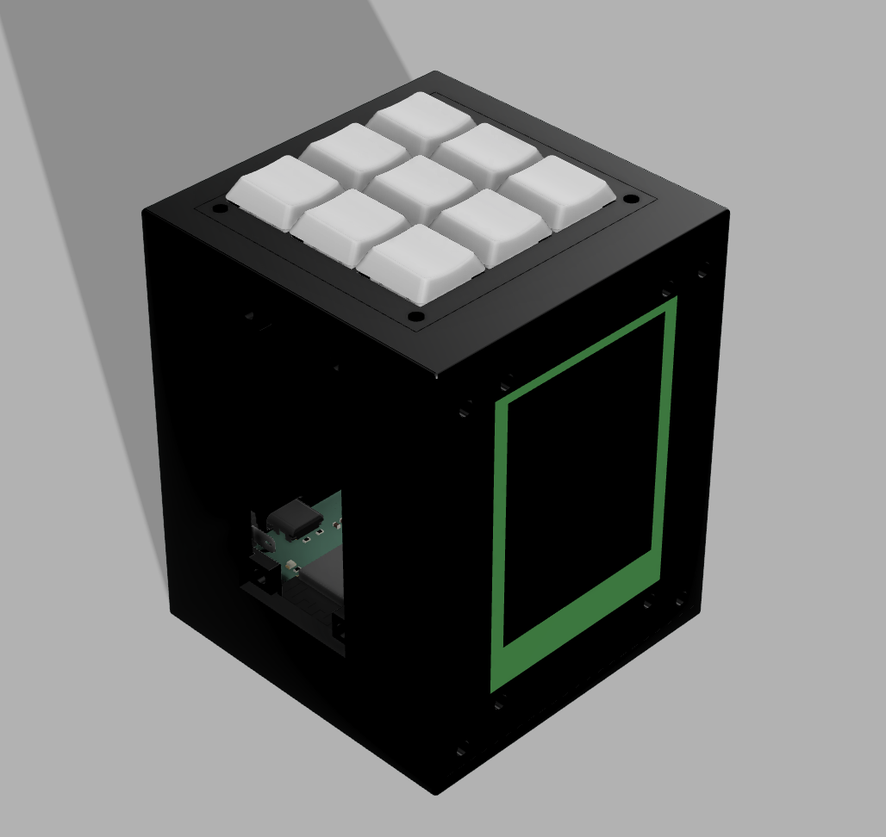
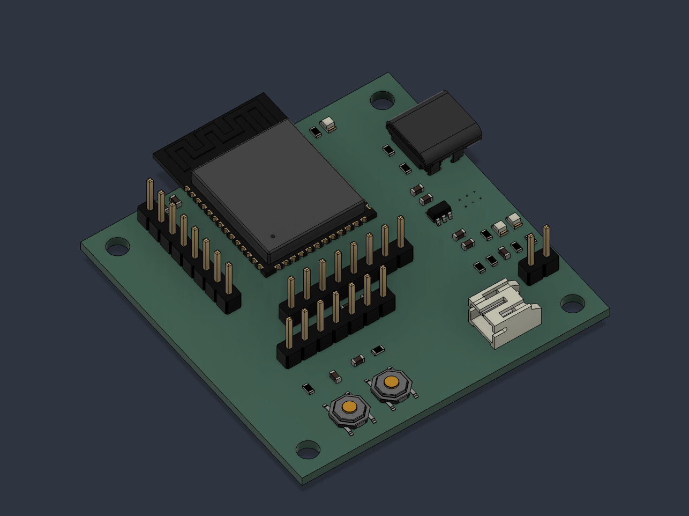
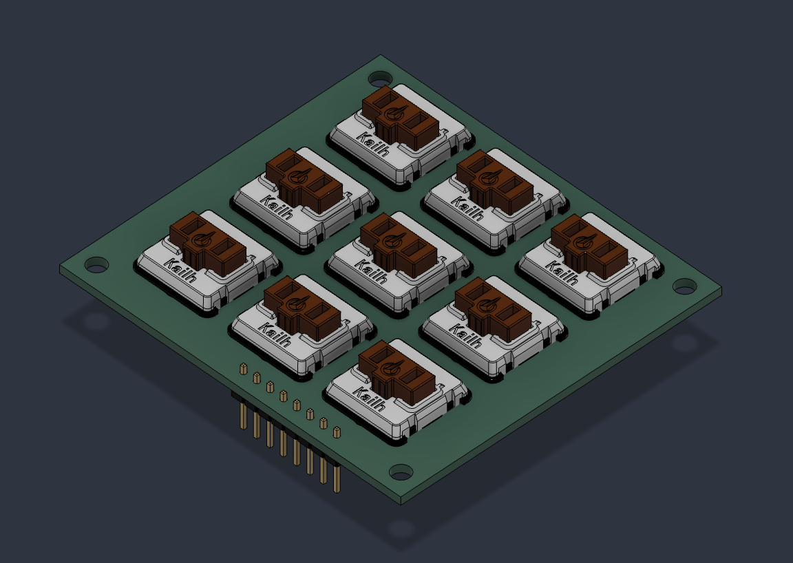
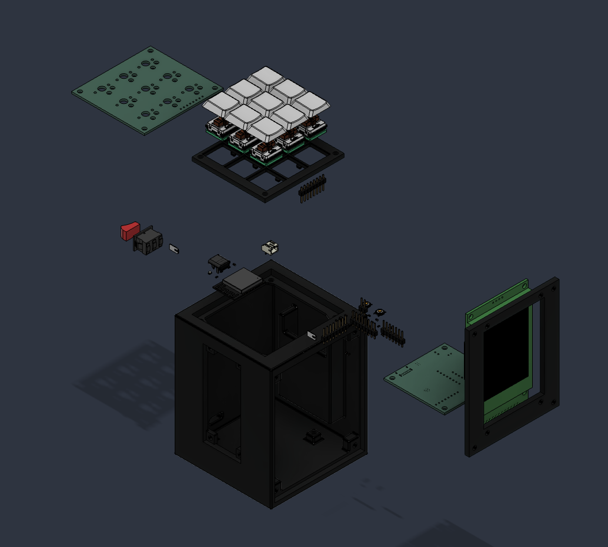
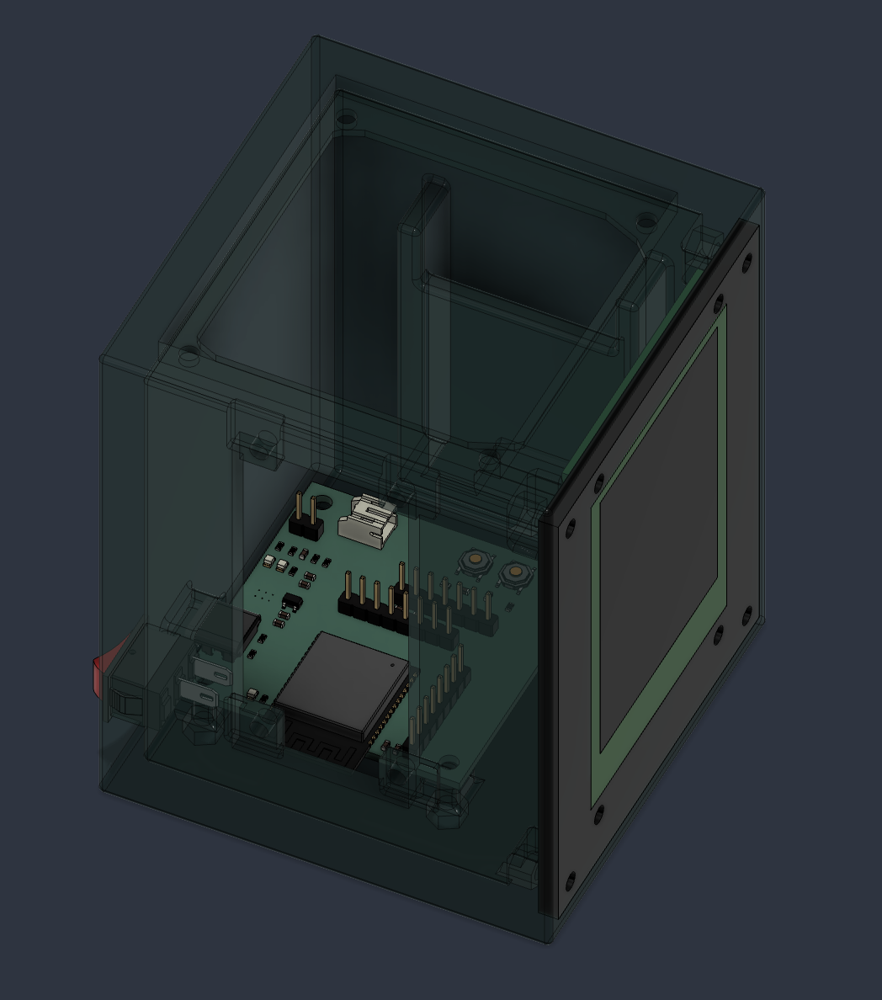
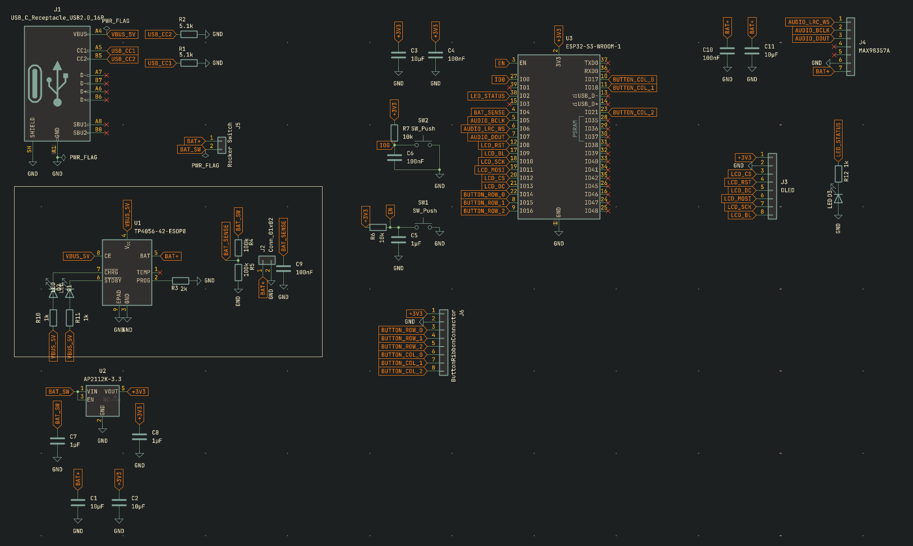
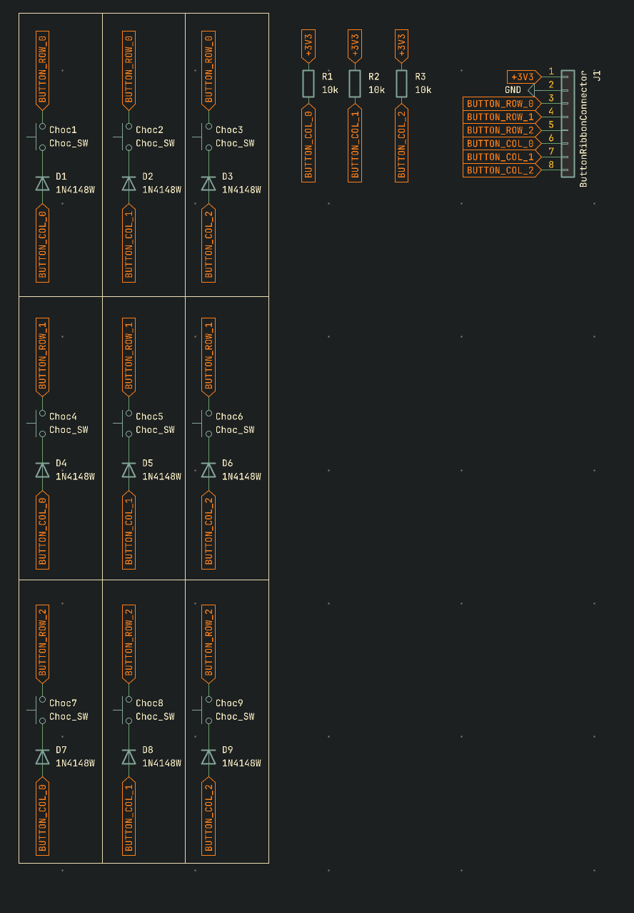

# Amigo

A desk companion cube that takes over the things you unlock your phone for, so you have no reason to pick it up.




## Why I made it

This is my project that I got an idea for when my phone's alarm went off. I always tend to use my phone a little bit in bed when I wake up. I thought I needed my phone to wake me up but then I thought of a product that replaced all the "utility" items your phone could do but without the distractions. I used screentime apps before but they always make it in fingers reach to disable it. Amigo takes the other approach. Instead of locking the phone down, it takes over the jobs you unlock the phone for in the first place, so there is nothing to reach for.

Physically locking the phone away is something I want to add later. The current design does not do it.

## What it does

1. **Wakes you up.** Alarm clock, so your phone doesn't have to be the thing next to your bed.
2. **Keeps your phone down.** The alarm, timer, and display all live on the cube, so there is no reason to unlock your phone for any of them.
3. **Utility stuff.** Timers, stopwatch, and the other simple things you'd normally pull your phone out for.
4. **Desk toy.** Displays pictures on a slide deck while you work.
5. **Classroom toy.** Small kids in elementary school can use it to develop cognitive function with memory games or reaction time tests. It can teach them things through games where they answer questions using the keypad as arrows or other controls to move, fight, and so on. It's a lot cheaper than buying a brand new computer or phone, so it's a budget friendly classroom toy.

## How it works

Amigo is two PCBs and a 3D printed case.

The **main board** carries an ESP32-S3-WROOM-1, a TP4056 LiPo charger, an AP2112K 3.3 V LDO, and headers for the display, the audio amp, the power switch, and the button matrix. It runs off a single-cell LiPo and charges over USB-C.

The **3x3 button matrix board** is a separate PCB with nine Kailh Choc hotswap switches and nine 1N4148W diodes in a standard row/column matrix, so nine keys read over six GPIO. It connects to the main board through an 8-pin ribbon header.














## Repo layout

```
hardware/
  main-board/          KiCad project for the ESP32-S3 main board
    production/        gerbers, BOM, pick-and-place files
  button-matrix/       KiCad project for the 3x3 switch board
    libs/              Keebio-Parts footprint library (third party, see credits)
    production/
cad/
  amigo.f3z            Fusion 360 Archive file for multi-component assemblies
  step/                STEP exports
  stl/                 printable parts
docs/                  assembly instructions
firmware/              (in progress)
images/                renders and photos
bom.csv                full bill of materials
```

## Assembly

### 1. Order the PCBs

Send `hardware/main-board/production/gerbers.zip` and `hardware/button-matrix/production/gerbers.zip` to your fab house. Both are 2-layer, 1.6 mm.

You can use PCBA to save time on soldering. If you don't it will be harder and you may or may not have to make a stencil. I ordered PCBA

### 2. Print the case

| Part | File | Notes |
| --- | --- | --- |
| Case | `cad/stl/case.stl` | Needs supports |
| Button cover | `cad/stl/button-cover.stl` | 10% Gyroid |
| Display mount | `cad/stl/display-mount.stl` | 10% Gyroid |
| Keycaps | `cad/stl/keycaps.stl` | x9 10% Gyroid |

Settings I used:
1. Gyroid Infill at 10%
2. Supports only on the case
3. The rest I used bambu slicer and their default settings for PLA

### 3. Solder the main board

If you ordered PCBA then skip. 

Use solder paste, wick, and flux to do solder. I believe using a stencil will make applying solder paste easier but I ordered PCBA. Solder all the parts on to it and also
don’t forget things like key caps for the buttons. Refer to Ki Cad files as
instructions for each cap or resistor and anything else you may need. 

Also the ESP board and the TP4056 should probably be soldered first because they are the most finicky. The TP4056 also has a thermal pad underneath. I suggest soldering all the passives like capacitators and resistors last.

### 4. Solder the button matrix

When you solder the button matrix it is important to make sure your diodes are the right direction. Normally when assmbling things I find it easier to have the file open whether it be a CAD or a PCB design. This way it is concrete in exactly what direction you planned for it earlier. Also don't forget keycaps while soldering.

### 5. Wire the modules

Again you can pull up the file to see which way the order is for the pin connectors. You can then work through it wire by wire by counting. This is the most concrete way to do it withought messing up. To be extra secure you can use some hot glue and secure the connection. 

### 6. Assemble the Cube

Use M3 screws and nuts to screw everything in. There should be a hole for each screw.

### 7. Flash the Firmware

Once firmware is written you can flash it. I have not written it yet I will update it later.


## Bill of Materials

Prices are per-unit at the quantity needed to build one Amigo. Several LCSC parts have minimum order quantities well above what the board uses (the 0603 passives ship in reels of 50 or 100), so the actual amount you spend at checkout will be higher than the totals below.

The main board was ordered as PCBA, so the surface-mount parts in the first table were supplied to the assembler rather than hand-soldered. The button matrix board was ordered bare and assembled by hand.

### Main board

| Ref | Part | Qty | Unit | Total | Link |
| --- | --- | --- | --- | --- | --- |
| U3 | ESP32-S3-WROOM-1-N16R8 | 1 | $5.16 | $5.16 | [C2913202](https://www.lcsc.com/product-detail/C2913202.html) |
| U1 | TP4056-42-ESOP8 LiPo charger (ESOP-8) | 1 | $0.19 | $0.19 | [C16581](https://www.lcsc.com/product-detail/C16581.html) |
| U2 | AP2112K-3.3TRG1 LDO (SOT-23-5) | 1 | $0.11 | $0.11 | [C23380830](https://www.lcsc.com/product-detail/C23380830.html) |
| J1 | USB4085-GF-A USB-C receptacle | 1 | $1.42 | $1.42 | [C7095263](https://www.lcsc.com/product-detail/C7095263.html) |
| J2 | S2B-PH-K-S-GW JST PH 2-pin, right angle | 1 | $0.18 | $0.18 | [C157932](https://www.lcsc.com/product-detail/C157932.html) |
| J3 | PPTC081LFBN-RC female header 1x08 2.54 mm (display) | 1 | $1.54 | $1.54 | [C3320851](https://www.lcsc.com/product-detail/C3320851.html) |
| J4 | PPTC071LFBN-RC female header 1x07 2.54 mm (audio amp) | 1 | $0.79 | $0.79 | [C5342086](https://www.lcsc.com/product-detail/C5342086.html) |
| J5 | PRPC002SAAN-RC pin header 1x02 2.54 mm (power switch) | 1 | $0.09 | $0.09 | [C3346540](https://www.lcsc.com/product-detail/C3346540.html) |
| J6 | PPTC081LFBN-RC female header 1x08 2.54 mm (button ribbon) | 1 | $1.54 | $1.54 | [C3320851](https://www.lcsc.com/product-detail/C3320851.html) |
| SW1, SW2 | TL3342F260QG tactile switch | 2 | $1.15 | $2.29 | [C2886894](https://www.lcsc.com/product-detail/C2886894.html) |
| D1 | YLED0805G green LED, 0805 | 1 | $0.01 | $0.01 | [C25170728](https://www.lcsc.com/product-detail/C25170728.html) |
| D2 | YLED0805B blue LED, 0805 | 1 | $0.01 | $0.01 | [C19273154](https://www.lcsc.com/product-detail/C19273154.html) |
| D3 | YLED0805R red LED, 0805 | 1 | $0.01 | $0.01 | [C19171391](https://www.lcsc.com/product-detail/C19171391.html) |
| C1, C2, C3, C11 | 10 µF 25 V X5R, 0603 | 4 | $0.48 | $1.92 | [C344022](https://www.lcsc.com/product-detail/C344022.html) |
| C4, C6, C9, C10 | 100 nF 50 V X7R, 0603 | 4 | $0.02 | $0.08 | [C14663](https://www.lcsc.com/product-detail/C14663.html) |
| C5, C7, C8 | 1 µF 25 V X7R, 0603 | 3 | $0.02 | $0.07 | [C29936](https://www.lcsc.com/product-detail/C29936.html) |
| R1, R2 | 5.1 kΩ 1%, 0603 | 2 | $0.01 | $0.01 | [C105580](https://www.lcsc.com/product-detail/C105580.html) |
| R3 | 2 kΩ 5%, 0603 | 1 | $0.01 | $0.01 | [C105581](https://www.lcsc.com/product-detail/C105581.html) |
| R4, R5 | 100 kΩ 1%, 0603 | 2 | $0.01 | $0.01 | [C14675](https://www.lcsc.com/product-detail/C14675.html) |
| R6, R7 | 10 kΩ 1%, 0603 | 2 | $0.01 | $0.01 | [C98220](https://www.lcsc.com/product-detail/C98220.html) |
| R10, R11, R12 | 1 kΩ 1%, 0603 | 3 | $0.01 | $0.02 | [C22548](https://www.lcsc.com/product-detail/C22548.html) |
| | **Main board subtotal** | | | **$15.47** | |

### Button matrix board

| Ref | Part | Qty | Unit | Total | Link |
| --- | --- | --- | --- | --- | --- |
| CHOC1-CHOC9 | Kailh Choc low profile hotswap socket | 9 | $0.78 | $7.02 | [Amazon](https://www.amazon.com/Mechkeeb-Kailh-Low-Hot-swappable-Socket/dp/B0BS3L174L) |
| | Kailh Choc low profile keyswitch | 9 | $1.92 | $17.28 | [Amazon](https://www.amazon.com/KAILH-Official-Chocolate-Mechanical-Keyboard/dp/B0B3MNBPSP) |
| D1-D9 | 1N4148W diode, SOD-123 | 9 | $0.01 | $0.08 | [C908248](https://www.lcsc.com/product-detail/C908248.html) |
| J1 | Header 1x08 2.54 mm (ribbon to main board) | 1 | $1.54 | $1.54 | [C3320851](https://www.lcsc.com/product-detail/C3320851.html) |
| R1, R2, R3 | 10 kΩ 1%, 0603 | 3 | $0.01 | $0.02 | [C98220](https://www.lcsc.com/product-detail/C98220.html) |
| | **Button matrix subtotal** | | | **$25.94** | |

Keycaps are 3D printed from `cad/stl/keycaps.stl`, so there is nothing to buy for them.

### Off-board parts

| Part | Qty | Unit | Total | Link |
| --- | --- | --- | --- | --- |
| HiLetgo 2.8 in ILI9341 SPI display, 240x320 | 1 | $16.39 | $16.39 | [Amazon](https://www.amazon.com/HiLetgo-240X320-Resolution-Display-ILI9341/dp/B073R7BH1B) |
| MAX98357A I2S audio amp breakout | 1 | $6.88 | $6.88 | [Amazon](https://www.amazon.com/MAX98357-MAX98357A-Amplifier-Interface-Raspberry/dp/B0DPJRLMDJ) |
| CQRobot speaker, JST-PH 2.0 mm interface | 1 | $7.99 | $7.99 | [Amazon](https://www.amazon.com/CQRobot-JST-PH2-0-Interface-Electronic-Projects/dp/B0738NLFTG) |
| EEMB 1100 mAh single-cell LiPo, JST connector | 1 | $6.15 | $6.15 | [Amazon](https://www.amazon.com/EEMB-1100mAh-Battery-Rechargeable-Connector/dp/B08VRYS8FT) |
| Rocker power switch | 1 | $1.35 | $1.35 | [AliExpress](https://www.aliexpress.us/item/3256812208202705.html) |
| Jumper wires, board-to-board ribbon link | 1 | $6.98 | $6.98 | [Amazon](https://www.amazon.com/Elegoo-EL-CP-004-Multicolored-Breadboard-arduino/dp/B01EV70C78) |
| PLA filament for case, button cover, display mount, keycaps | 1 | $20.00 | $20.00 | [Polymaker](https://shop.polymaker.com/products/polymaker-pla-pro?variant=41550910652473) |
| M3 screws and nuts pack of 100 | 1 | $15.30 | $15.30 | [McMaster](https://www.mcmaster.com/products/screws/socket-head-screws-2~/steel-socket-head-screws~~/?s=m3+screws) |
| PCB fabrication: main board PCBA and button matrix bare PCB | 1 | $50.65 | $50.65 | [JLCPCB](https://jlcpcb.com/) |
| | | | **$131.69 plus fasteners** | |

The Amazon parts ship in fixed pack sizes rather than the exact count the build uses. The Unit column is the per-item price and the Total is what one Amigo consumes, so your checkout total will be higher.

### Total

**$173.10 plus fasteners** to build one Amigo: $15.47 for the main board, $25.94 for the button matrix, and $116.39 in off-board parts and fabrication. Fabrication is the single largest line at $50.65.

## Tools used

Not part of the build, listed for anyone reproducing it.

| Tool | Link |
| --- | --- |
| Soldering iron | [Amazon](https://www.amazon.com/Wonderway-Soldering-Electronics-CELLPHONE-Repairing/dp/B0BLSJQPR6) |
| Desoldering pump | [Amazon](https://www.amazon.com/Lesnow-Desoldering-Electronics-Disassemble-Electrical/dp/B0F8BJPC9Y) |
| Multimeter | [Amazon](https://www.amazon.com/ANENG-Multimeter-Resistance-Continuity-Automotive/dp/B0BYD32JZV) |


## Firmware

Not written yet. The plan is firmware that lets people program the device, download or make games, and customize it for their needs, with over-the-wifi updates so the software keeps getting better.

## Credits

The `hardware/button-matrix/libs/Keebio-Parts.pretty-master` footprint library is Keebio's, used under its own license for the Kailh Choc footprints. Everything else in this repo is my own work.

## What I learned

I used a bunch of stuff on this project for the first time, like KiCad to make my PCBs. I realize how hard it is to actually verify if some PCB works before you order it. I guess it is because I didn't have a breadboard kit. Some of the most memorable things I learned about electronic design is things like not forgetting a fuse or remembering to add EN and Boot switches. I also learned to try and plan the actual product out before because I wanted motors to drive it but I didn't account for any sizing constraints and it turned out to be to out of reach for a first project.

I really enjoyed putting everything together at the end in Fusion with the actual CAD of the PCB. My least faveorite part was actually ordering everything because who knew things cost money! I didn't notice but my amazon cart added up quick and I made a switch to ali express and was able to save some money. JLC was also really annoying one day where it kept rejecting my files and it didn't work and I had to restart the entire process from scratch to try and debug it. Another thing I learned while ordering was the company LCSC sells parts but it takes time to quote it. They sent me an email but I didn't check it so I forgot to actually order it! Overall I am excited to assmble this thing I have been working on for a long time.


---
